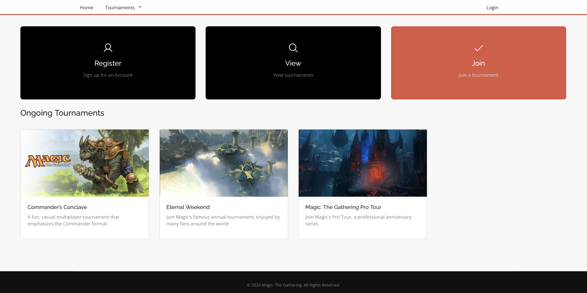
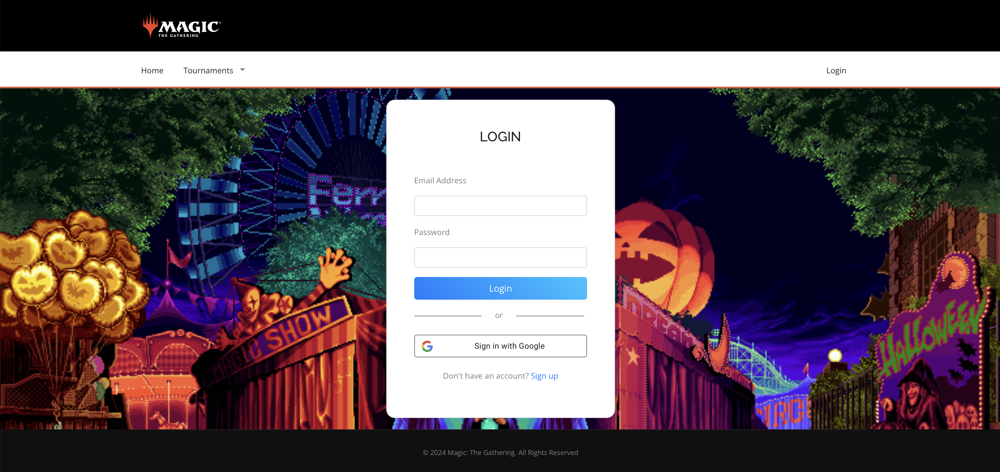
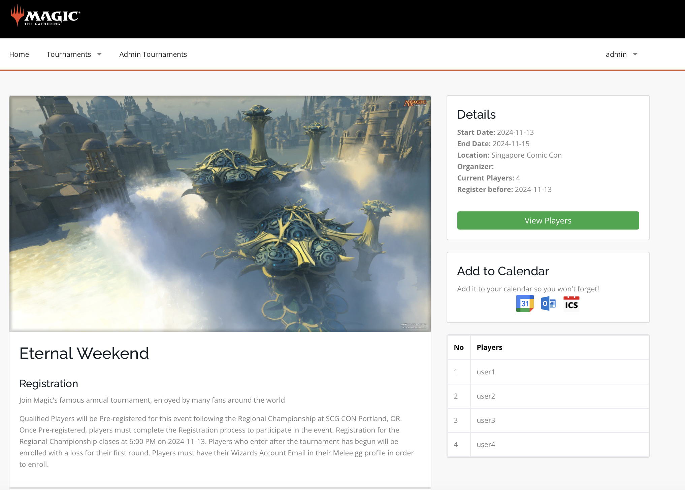
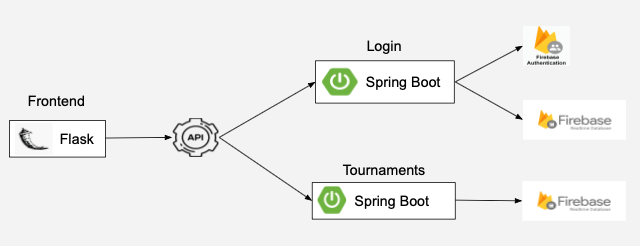
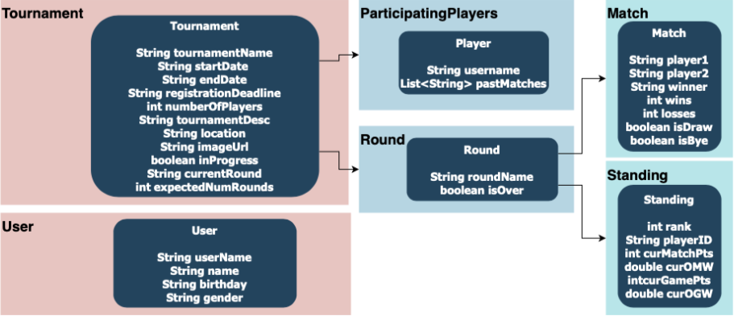
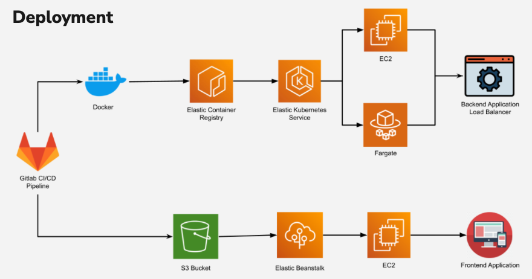

# MatchMage

## Overview

**MatchMage** is a tournament management system solution created for **Magic: The Gathering (MTG)**. With a huge player base and tournaments that can scale to over 7500 players, the competitive structure requires a robust system for implementing **scalability**, calculating **tiebreaking**, and **real-time data management**.

**Users** can create accounts, join, leave and view the interim and final results of tournaments. **Admins** can create, update, delete and manage the rounds of a tournament.

*Home Screen*



*Login Screen*



*Tournament View*


## Tech Stack
FrontEnd: Flask
Backend: Spring Boot, Mockito
Database: Firebase
Deployment: GitLab, Docker, ECR, EKS, Fargate, EC2



## Match Making Algorithm: Swiss Pairing

**Round 1: Random pairing between players**
- If there are an odd number of players, assign a bye ( free win ). For the first round it would be assigned randomly. For subsequent rounds, the bye will be randomly assigned to a player with the lowest match-points.

**Round 2 onwards:**
- Pair based on match point total, if there are an odd number of players with the same match point total, one player from the next highest point total is selected to play with the players of the higher point total. 

**Tiebreakers will use the following player stats to distinguish between players in the following order**

- Opponent Match Win Percentage (OMW): Summation of opponent match win percentage divided by number of opponents

- Opponent Game Win Percentage (OGW): Summation of opponent game win percentage divided by number of opponents

- Game Win Percentage (GW%): Personal game win percentage


## Database



Firebase implements a hierarchical database structure. A collection contains documents. In turn, documents contain document-specific data in fields, or other subcollections. Firebase's real-time functionality synchronizes data instantly across all connected clients whenever there’s a change in the database, making it ideal for use cases like live scoreboards.


## Cloud Deployment



We use GitLab CI/CD for continuous integration and delivery. The process begins in GitLab, where changes trigger a Docker build. This Docker image is then tagged and pushed to the Amazon ECR. From there, we deploy the backend application using EKS, which manages containerized applications. The EKS cluster deploys the image to both EC2 instances and Fargate, all routed through a load balancer for efficient traffic distribution. On the frontend, our GitLab pipeline packages the application and uploads it to an S3 bucket. From there, Elastic Beanstalk pulls the code, deploys it on an EC2 instance, and provides an endpoint for user access.


## Setup
**To run the Spring Boot application (back-end):**

1. Navigate to 
```cs203/Firebase-java/demo```
2. Make Maven wrapper executable
```chmodn +x mvn```

3. Run Spring Boot
```mvnw spring-boot:run```

**To run the Flask application (front-end):**

1. Navigate to 
```cs203/flask```

2. Install dependencies
```pip install -r requirements.txt```

2. Run in terminal: 
```flask --app application.py --debug run```

## Contributors

Gary, Peter, Tze Jun, Ian, Darren
